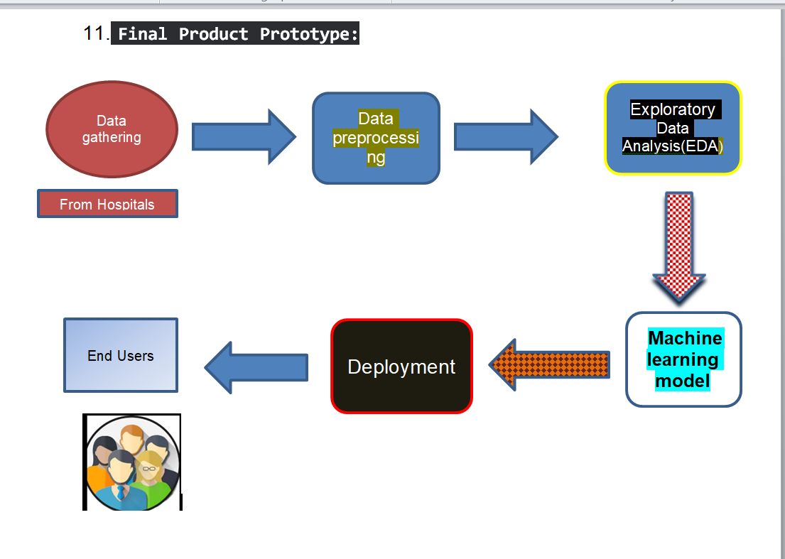

# Feynn_labs_projects

## Notebook Summary: McDonald's Customer Segmentation Analysis 🍔📊

This notebook analyzes McDonald's customer data to understand preferences and segment customers for targeted marketing and retention strategies.

**Key Steps and Insights:**

* **Data Loading and Exploration:**
    * Imports essential libraries: pandas, NumPy, seaborn, matplotlib.
    * Loads the dataset (`mcdonalds.csv`) into a pandas DataFrame.
    * Explores data using `head()`, `info()`, `describe()`, `value_counts()`, histograms, and distribution plots.
* **Data Preprocessing:**
    * Handles outliers in 'Age' using IQR method and box plots.
    * Imputes missing values with mode (categorical) and mean (numerical).
    * Applies Label Encoding to categorical features using `LabelEncoder()`.
* **Principal Component Analysis (PCA):**
    * Reduces data dimensionality and identifies key preference drivers.
    * Applies `PCA()` to encoded categorical features.
    * Visualizes explained variance and relationships with scree plots and biplots.
* **Customer Segmentation:**
    * Applies KMeans clustering to encoded features.
    * Uses Elbow method (`KElbowVisualizer`) for optimal cluster number.
    * Analyzes clusters using descriptive statistics, mosaic plots, and box plots.
* **KModes Clustering:**
    * Applies KModes for refined segmentation (suitable for categorical data).
    * Uses Elbow method to determine optimal cluster number for KModes.
    * Analyzes clusters using descriptive statistics and visualizations.

**Insights:**

* **Taste Improvement Initiative:** Gather feedback from specific customer segments (Clusters 0 and 1) to enhance flavors. 🎯
* **Customer Retention Strategy:** Develop targeted retention programs for specific segments (Clusters 3 and 4) using personalized rewards. 🎁
* **Age-Based Targeting:** Focus on customers below 40 years of age in Cluster 3 for retention efforts. 👨‍👩‍👧‍👦
* **Overall Preferences:** Gain insights into customer preferences for McDonald's attributes like taste, convenience, price, and healthiness. 👍

**Key Functions and Libraries:**

* **pandas:** `read_csv()`, `head()`, `info()`, `describe()`, `value_counts()`, `groupby()`, `apply()`, `map()`, `crosstab()`
* **NumPy:** `mean()`, `quantile()`, `where()`
* **seaborn:** `histplot()`, `boxplot()`, `scatterplot()`, `catplot()`
* **matplotlib:** `hist()`, `show()`, `plot()`, `xlabel()`, `ylabel()`, `title()`
* **scikit-learn:** `LabelEncoder()`, `PCA()`, `KMeans()`, `OrdinalEncoder()`
* **kmodes:** `KModes()`, `cost_`
* **yellowbrick:** `KElbowVisualizer()`
* **statsmodels:** `mosaic()`

**Machine Learning Algorithms:**

* **KMeans Clustering**
* **KModes Clustering**
* **Principal Component Analysis (PCA)**

 
## Eye Sight Prediction model prototype:

